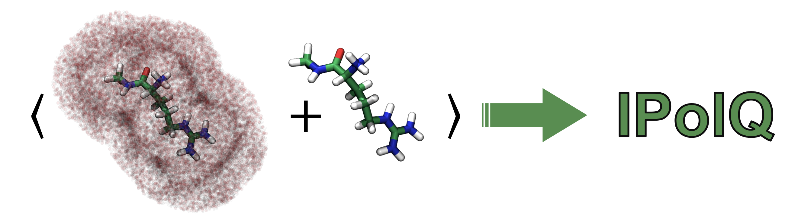
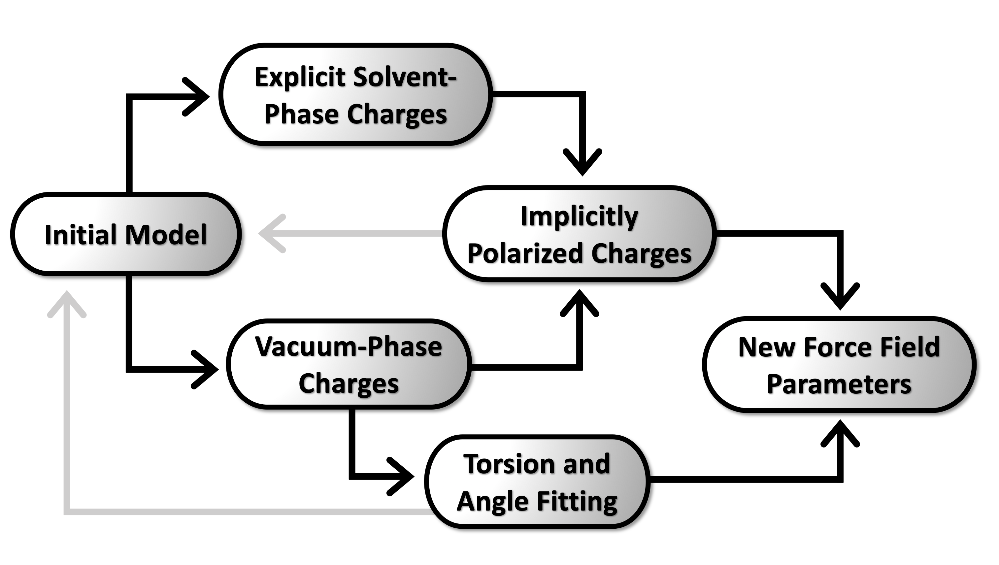

# Scripts for ff15ipq ligand parameter derivation

    

This directory provides an example of how to derive ff15ipq compatible parameters for a monastrol small molecule using slurm based HPC resources.

### Branches
* Use the main branch if you're deriving parameters for a new molecule
* For an example of what that output files look like, see the monastrol branch
    * This is currently the most up-to-date version of the files

### Dependencies:
* AmberTools
* Amber (pmemd)
* ORCA

### The workflow is as follows:

    

* generate a pdb file of your small molecule or ligand
    * this can be done using something like Avogadro
    * in Avogadro, the molecule can also be energy minimized (recommended)
* derive a set of implicitly polarized (ipq) atomic partial charges for your molecule
    * see the /charges directory
* optimize the initial set of bonded force field parameters that were roughly estimated in the charge derivation step
    * this is done *in vacuo* and uses the finalized vacuum phase atomic charges
    * see the /bonded directory
* you will now have an finalized library file containing the atomic charges and a frcmod file containing the bonded parameters for your molecule of interest
    * load these files into tleap along with the ff15ipq force field and you're good to go! 

### See the following publications for more information about the ff15ipq protein force field:
* KT Debiec, DS Cerutti, LR Baker, AM Gronenborn, DA Case, and LT Chong. “Further along the road less traveled: AMBER ff15ipq, an original protein force field built on a self-consistent physical model.” J. Chem. Theory Comput. 2016, 12, 3926. https://doi.org/10.1021/acs.jctc.6b00567
* AT Bogetti, HE Piston, JMG Leung, CC Cabalteja, DT Yang, AJ DeGrave, KT Debiec, DS Cerutti, DA Case, WS Horne, and LT Chong. “A twist in the road less traveled: The AMBER ff15ipq-m force field for protein mimetics.” J. Chem. Phys. 2020, 153(6), 064101. https://doi.org/10.1063/5.0019054
* DT Yang, AM Gronenborn, LT Chong, “Integrating Fluorinated, Aromatic Amino Acids into the Framework of the AMBER ff15ipq Force Field.” J. Phys. Chem. A  2022, *in press*; https://doi.org/10.1021/acs.jpca.2c00255

### A more detailed tutorial of the ipq parameter derivation process is available:
* IPQ Charges: https://ambermd.org/tutorials/advanced/tutorial28/index.php
* IPQ Bonded Parameters: https://ambermd.org/tutorials/advanced/tutorial32/index.php
